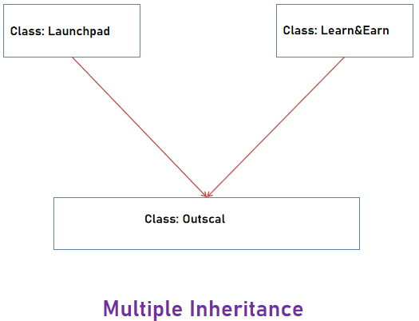
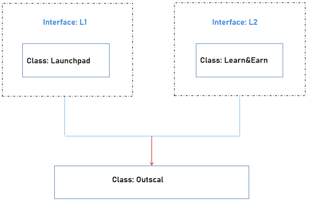

## Why do we use Interface?



As shown in the above diagram, class Outscal inherits the features of class Launchpad and Learn& Earn.

But C# does not support multiple class inheritance, because they reasoned that adding multiple inheritances added too much complexity to C# while providing too little benefit. In C#, the classes are only allowed to inherit from a single parent class.

To overcome this problem we use interfaces to achieve multiple class inheritance. We can indirectly inherit the features of Launchpad and Learn&Earn class into Outscal class using interfaces. As shown below,



Both L1 and L2 interfaces are implemented by Launchpad and Learn&Earn class. Now Launchpad and Learn&Earn class define projects() and courses() method. When an Outscal class inherits L1 and L2 interfaces you need not redefine projects() and courses() method just simply create the objects of both classes and access the projects() and courses() method using these objects in Outscal class

Syntax.

Syntax starts with the interface keyword followed by the name for the interface and then the body.

```C#
interface <name_for_interface>{//abstract methods//abstract properties.}
```

These interfaces can hold various methods, indexers, properties and also events as members.
